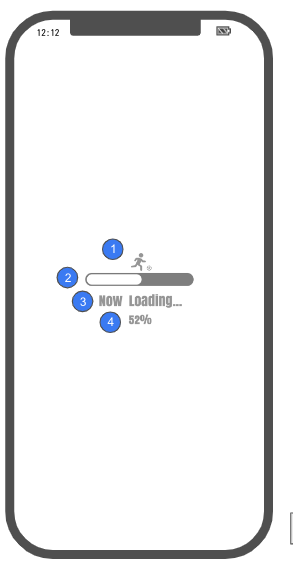
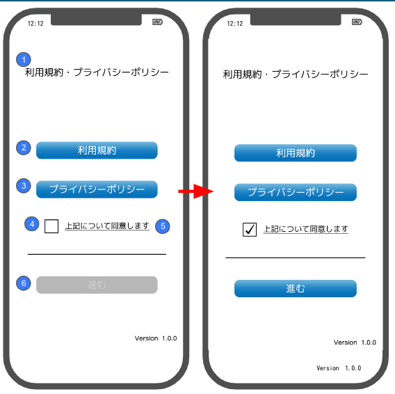
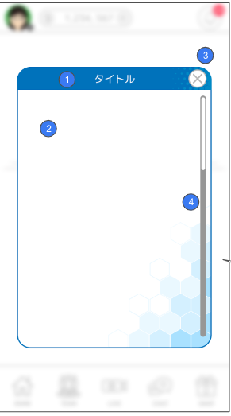
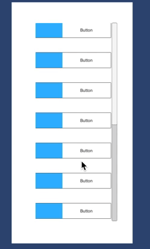

## 開発目的

Unityの操作に慣れるため
 
 
 
## 開発物

Birdプロジェクトの模倣アプリ
 
 
 
## 開発項目

- ロード画面
- 規約確認画面
- ホーム画面
 
 
 
## 開発項目の具体的な実装内容

### ロード画面
#### プログレスバーの実装
- 5秒でゲージが満タンになるようにメーターを動かす（メーターの動く速度は一定でOK）
- 現在溜まっているゲージの割合を数値（％）で表示させる

※ ロード画面のイメージ

 
 
 
### 規約確認画面
- 利用規約、プライバシーポリシーのボタンが押下された時にモーダルを表示させる
- モーダルの中に利用規約、またはプライバシーポリシーの文を表示させる
- チェックボックスにチェックが入った時に、進むボタンがアクティブになり押せるようにする
　（チェックボックスにチェックが入っていないときは、進むボタンは押せないようにする）

↓ 規約画面のイメージ

 
 
↓ モーダルのイメージ図（背景はぼかさなくていい）

 
 
 
 
### ホーム画面
- ボタンを縦一列に10個並べて用意して、画面に入りきらない分はスクロールで表示できるようにする
- 各ボタンの左側には画像を設置し、右側にはテキストを表示させる（ボタンのOnClick処理は実装しなくていい）

↓ ホーム画面のイメージ

 
